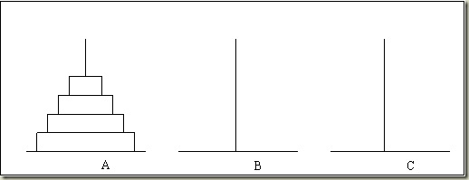

### 功能要求：

1.规则：汉诺塔（又称河内塔）问题是源于
印度一个古老传说的益智
玩具。大梵天创造世界的时候做了三根金刚
石柱子，在一根柱子上从下往上按照大小顺
序摞着64片黄金圆盘。大梵天命令婆罗门
把圆盘从下面开始按大小顺序重新摆放在
另一根柱子上。并且规定，在小圆盘上不
能放大圆盘，在三根柱子之间一次只能移
动一个圆盘。

2.要求：打印出移动的步骤，like this：
    
    A -> B
    A -> C
    B -> C
    ...
#include<iostream>
using namespace std;

void move(char sou, char tar)
{
	cout << sou << "->" << tar << endl;
}
void  hanoi(int n, char sou, char tmp, char tar)
{
	if (n == 1)
		move(sou, tar);
	else
	{
		hanoi(n - 1, sou, tar, tmp);
		move(sou, tar);
		hanoi(n - 1, tmp, sou, tar);
	}
}
int main()
{
	int n;
	cin >> n;
	hanoi(n, 'A', 'B', 'C');
	return 0;
}
