# 实验报告
## 功能
- 鼠标左键棋盘来直接落子
- 可选择先后手的GUI
  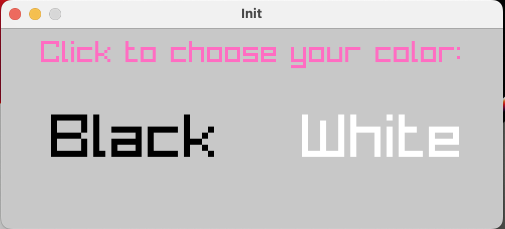
- 显示每回合得分、落子坐标、AI思考时间及哈希命中数

---
## 实现
由于割裂开各个模块来分别讲述它们的作用会显得逻辑混乱，所以我按照设计程序时的思路来写，在此过程中逐步引出各个模块。

### 棋局存储与交互
首先，用一个二维数组`gobang`来存储当前棋局，用数字来标记各个位置的情况。0表示空位，1表示白子，2表示黑子。要绘制棋盘，只需确定合适的网格大小和棋子半径即可，每次落子之后调用`drawChessboard`函数重绘一遍最新棋盘。要实现鼠标左键落子，可以利用raylib库中的`GetMousePosition`函数获取鼠标物理位置，再根据原先确定的网格大小来将该物理位置映射为最接近的棋盘坐标，然后修改`gobang`数组，该过程用`convertPosition`函数实现。将物理坐标映射为棋盘坐标的关键代码为：
```c
Vector2 movePosition=GetMousePosition();
Coord res;
for(int i=0;i<SIZE;++i){
  if(movePosition.y-((i+1)*INTERVAL+ i * LINE_WID) < INTERVAL / 2){
    res.y=i+BORDER;
    break;
  }
}
for(int j=0;j<SIZE;++j){
  if(movePosition.x-((j+1)*INTERVAL+ j * LINE_WID) < INTERVAL / 2){
    res.x=j+BORDER;
    break;
  }
}
```
（宏BORDER出现的原因会在下文提到）

### 估值函数与启发式搜索
解决交互问题后确定AI的落子逻辑。在查阅资料后大概明白了最大最小值搜索和alpha-beta剪枝的思想，转而先考虑估值函数的设计。

网上的大多数实现是每次落子之后遍历整个棋盘并查找棋盘上的所有棋型，AI棋型的总分值减去玩家棋型的总分值即当前棋局的分值。这里有两个问题：
1. 如何遍历？
   考虑到不能遗漏棋型，所以每个位置都要遍历。然而棋局上的某个位置在某个棋型中的位置并不容易确定，比方说棋型01112（0表示空位，1表示己方，2表示对方），假如当前遍历到棋盘上的（6，7）位置且为己方棋子，要检查（6，7）及周边是否能形成该棋型，则（6，7）既可能对应最左边的1也可能对应中间或最右边的，而且米子方向都要检查一遍。
2. 如何在棋型设置得尽可能多的情况下减少运行时间？
   棋型设置得越多，估分越精确，但由于要多次判断即写大量的if语句，所以代码量越大且运行时间越长。

因为若棋型设置少则会影响估值精度，所以我先确定了尽可能多的棋型：
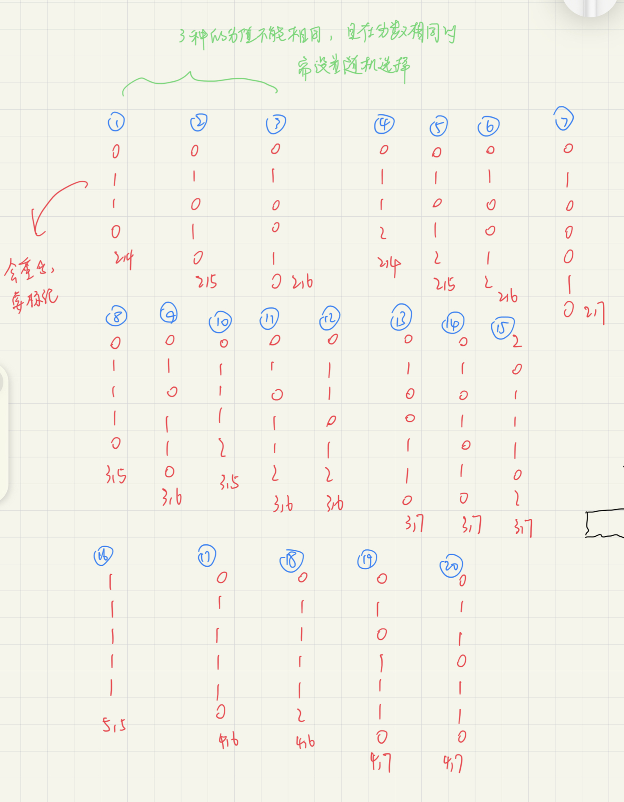

为了解决第一个问题，考虑减少需要遍历的对象的数量。由于每次落子时只会对该落子的周围产生棋型上的变化，并且影响范围最大为以落子点为中心的9*9方格，所以用全局变量`score`记录当前局面的总分值（分值越大表示AI越占优势），每次落子之后更新该9\*9方格的分值并将增量加到`score`上即可。这样有两个好处：
1. 减少要遍历的数量；
2. 不需要再为启发式搜索专门写一个函数。
   启发式搜索的思路是在剪枝函数`alphaBeta`的每一层中先遍历棋盘上所有剩余空位，评价每个空位的好坏并依此给出空位的排名，在下一层的搜索中先搜索评分高的空位，由于在评分高的空位上的落子往往最终能得到相对更好的结果，所以在这一层可以减去更多的分支。由于我的估值函数是完全针对某个落子的评分，所以可以直接在启发式搜索中使用。

接着解决第二个问题：如何减少if的判断呢？大量if语句有两个大问题：
1. 代码量大，代码复用率高但又难以统一，且if嵌套深、分支多，书写时很容易出错；
2. 效率低。大多数的判断都不会直接进行到最里层，比如正确棋型为011110，在判断是否为011112时前面01111相同但最右边不同，那么判断结果为假，相当于前面4个的判断给浪费掉了。

考虑到直接取现有值效率一定最高，于是用多维数组来存储棋型及其对应的分值，由于数组下标的组合非常多所以不考虑预先定义，换作开局时用循环初始化即可。对某个落子点估值时，直接将其某一方向上的棋盘棋子作为下标，然后取棋盘数组上对应的值即可。由于米子方向都可能形成新棋型，所以每个落子取4次。又因为要把未落子时该9*9范围内的分值总和删掉再加上新的9\*9范围分值总和，所以每个落子实际取8次。相对于大量的if语句，代码不仅更容易管理，而且效率有极大提升。估值部分集中在`evaluate.c`中，有两个需要注意的问题：
1. 即使棋型相同（即对于某一确定棋型来说棋型数组的下标对应相同），AI和玩家也不能共用一套棋型数组。
   `head.h`中的宏`FACTOR`作为玩家的活五、活四、冲四、活三的权重会调高玩家这四种类型的棋的分值，所以棋型数组下标对应相同时，玩家和AI的棋型数组的值也不一样。之所以要调高玩家特殊棋型的权重，是因为AI需要更倾向于防守。比方说，在`alphaBeta`函数的某一层中玩家形成了冲四，且在下一层中AI也形成了冲四，如果两者冲四的分值相同，那么AI就有可能最终这种走法，因为玩家的冲四与AI冲四相抵消，相当于认为玩家并没有造成多大的威胁。然而实际上假如AI采取了这种走法，那么在下下层中玩家就可以成五了，这对于棋力来说是不容许的。为了避免类似情况出现必须调高玩家高分值棋型的权重。
2. 取棋型数组的值时越界。
   为了避免增加if语句判断是否可能越界，我把`gobang`数组设置为23*23而非15\*15，也即在原棋盘周围设置了宽度为4的边界（宏`BORDER`），边界的值设置为`BORDER_NUM`。这样就避免了越界，仍然可以以棋盘上的棋子情况作为下标取棋盘数组的值。

### Zobrist缓存
因为剪枝函数会用到zobrist来做哈希表，所以解决完估值函数后先介绍`zobrist.c`模块。

剪枝与哈希的根本目的其实是相同的，就是减少不必要的搜索。用zobrist算法来哈希的原理在于：可以在低冲突率的前提下为不同的棋局生成唯一的哈希值，因此如果某一局面已经在之前搜索过了，那么由于最大最小值搜索的本质是深度优先搜索，所以在没有被剪去的情况下每一个分支都会搜到最底层，也就是说已经知道该搜索过的局面在之后所能获得的最好结果了。于是通过哈希值可以将某一棋局与它所能获得的最好分数绑在一起，之后的搜索中如果再次遇到该局面，就可以直接取出该值并return，效果与把这条分支剪去很类似。

具体实现步骤如下：
1. 初始化。
     1. 首先分别为AI和玩家生成在棋盘上的不同位置的棋子的哈希值。首先需要一个随机度较高的能生成64位整数的随机数生成器：
     ```c
     uint64_t get64rand() {
       return
         (((uint64_t) rand() <<  0) & 0x000000000000FFFFull) |
         (((uint64_t) rand() << 16) & 0x00000000FFFF0000ull) |
         (((uint64_t) rand() << 32) & 0x0000FFFF00000000ull) |
         (((uint64_t) rand() << 48) & 0xFFFF000000000000ull);
     }
     ```
     2. 其次用二维数组`humTable`和`comTable`储存双方在不同位置的棋子的键值：
     ```c
     for (int i = 0; i < SIZE; ++i) {
           for (int j = 0; j < SIZE; ++j) {
               humTable[i][j]=get64rand();
               comTable[i][j]=get64rand();
           }
       }
     ```
     3. 定义一个`uint64_t`类型的变量`key`并初始化为0。
<br>
2. 考虑每个局面及对应分值的存储方式。
   首先要明确zobrist缓存在什么情况下可以使用。
   - 只有在AI的同一个回合中，zobrist缓存才可能被使用。原因：
   不可能取上一个回合中的缓存，因为本回合能搜到的局面深度比上一回合搜到的深度深。比如，若剪枝函数能搜6层，上一回合开始时棋盘上有20个棋子，那么搜到最深的局面是棋盘上已有26个棋子；在本回合开始时，棋盘上有22个棋子，最深能搜到有28个，但若要取上一回合的缓存来当作结果的话，也就是当搜到棋盘上有26个棋子就返回，那么相当于深度从6退化到了4，这虽然节省了一点时间，但削弱了棋力，当然是不容许的。于是zobrist只能在同一个回合中使用，也就是在同一次搜索中使用。
   <br>
   - 在AI的同一个回合中，只有深度相同时才可能使用。原因：
   如果缓存能被取出，说明当前局面与之前搜索过的某次局面相同，则棋盘上的总的棋子数量必然相同，因为在剪枝函数中每一层落一子，所以假如能被取出则深度必然相同。
<br>
3. 由上述分析，可以设计存储方式：
   1. 结构体Hash表示在局面键值为lock时再往后搜depth层己方所能获得的最好分数value：
   ```c
   typedef struct {
     int value;
     int depth;
     uint64_t lock;
   }Hash;
   ```
   2. 定义一个Hash数组：
   `Hash zobristCache[TABLE_SIZE]`
   下标是某一局面的键值映射后的结果。需要映射的原因是64位整数较大，一个数组无法开到那么大，所以需要经映射后压缩键值大小。变量`lock`的作用有两个：
      - 因为下标是映射后的键值，如果将下标直接当作局面的唯一标识的话冲突风险会增大。所以同时将未经映射的键值存储到结构体中，降低冲突率；
      - 在初始化时可以为每一个`zobristCache`数组元素的`lock`指定一个初值（正负无穷大），这样在取缓存时就可以判断这个局面是否已经在之前的搜索中经历过了。
<br>
4. 除搜索的最底层之外的每次落子后（无论实际还是在搜索中模拟落子），都用`humTable`或`comTable`中对应位置的键值异或`key`，随后以映射后的`key`为下标访问`zobristCache`数组的元素，若该元素的`lock`为初值，则不取；否则，如果该元素的`depth`与当前深度也相同，则直接取该元素的`value`作为返回值返回。
<br>
5. 对于从下一层return上来的返回值，将其作为`value`存储在当前局面对应的zobrist缓存中，同时存储当前深度为`depth`。

增加zobrist缓存后AI思考时间可以缩短20s至60s左右的时间，每一次搜索可以命中约300到500万次（如下图），效果还是很明显的。
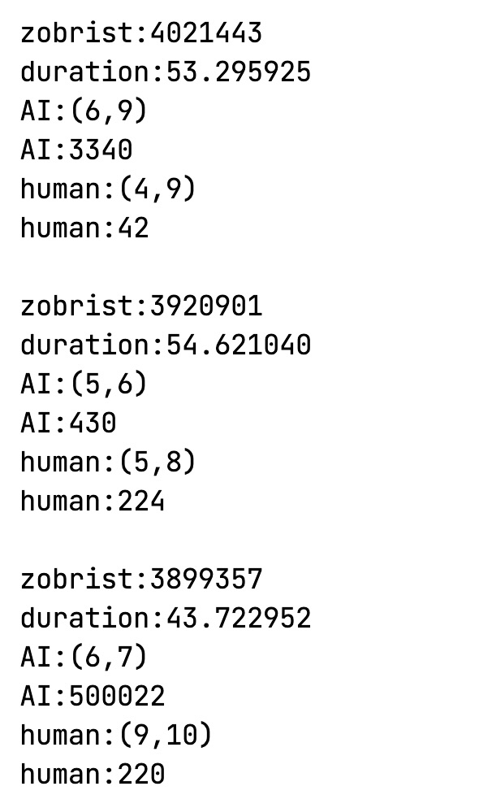

### 搜索与剪枝
首先是对最大最小值搜索和alpha-beta剪枝的理解：

模拟博弈的第一步是确定一个可以量化局势好坏的标准，已经在`evaluate.c`模块中实现。其次就是确定博弈双方行动的原则：
- 在每一回合中，走棋方都会选择对自己最有利的落子。
- 在搜索中，己方层的得分依赖下一层对手的落子，因为是否“对自己最有利”不仅取决于本回合所能产生的棋型好坏，还依赖于下一回合对手的应对。比如，若己方层有两个落子点a和b，落在a点则`score`增加为1200，落在b点则为1000，但下一回合对手落子之后a点分支所得的`score`为800，b点分支为900，显然原先更应该落在b点。
- 在剪枝函数的某一层中，beta是上界，alpha是下界；在min层（选择下一层的返回值中最小者的层，max层反之）中修改beta，意为最多只能接受下一层中对手获得beta分数；在max层中修改alpha，意为在下一层中对手走完后最少接受自己的得分为alpha；于是在min层中不断选取beta的较小者，相当于不断降低上界，增大己方优势；同时，min层的alpha是上一层（max层）在循环到该子节点时已经搜索到的最好情况，如果min层获得的上界beta降得过低而小于alpha，则上一层一定不会选择这个子节点，于是剪枝；同理，下一层（max层）的beta源于该层的beta，则下一层在不断推高alpha的同时不能超过beta，否则该层一定不会选择下一层的这个子节点。

由于函数签名和返回值的限制，需要一个顶层入口函数`makeMove`；真正核心在于剪枝函数`alphaBeta`。`alphaBeta`的函数体内有AI与玩家双方的代码，尽管两方代码结构相同但由于涉及变量不同、表达式细节有差异而比较难合并，所以代码较长。下面只介绍函数签名和AI方的代码。

#### 形参
```c
int alphaBeta(int (*gobang)[SIZE], int alpha, int beta, int depth, int player, int val, Piece cur, int spaceCount);
```
- 由上分析，只需int作为返回值类型，表示依照当前落子走到最底层所获得的对己方最有利的分数。
- 因为要分辨“己方”是AI还是玩家，所以需传入参数`player`。
- 在估值模块中提到，我的评估方式是仅对落子周围更新分数，因而与网上多数剪枝函数的逻辑不同，不是直到最底层才对整个棋盘做一次遍历和估值，而是每一层落子后获取分数增量并加到当前棋局的总分数上，所以需要参数`val`来记录当前棋局的总分数。
- 在顶层入口函数`makeMove`中，先调用函数`rankMove`对剩余空位启发式搜索，再对排好序的空位依次调用`alphaBeta`，因而需要`Piece`类型参数`cur`来记录落子的坐标，在剪枝函数的其他层中同理。另外，由于在上一层的启发式搜索中已经做了该落子点的估值，所以将该值赋给`cur.value`并随`cur`传入当前层，从而能直接将分值加到`val`上而不必重复估值。
- 每一层都要进行启发式搜索，在申请内存时需要知道剩余空位的个数`spaceCount`。

#### AI方代码
代码较长，不过剪枝函数是个集成函数，应用了前面提到的大部分模块；又因为调用频繁，是代码上绝对的性能瓶颈所在，所以不选择拆分了。代码分析见注释。
```c
//注意：为了和makeMove函数保持一致，上一层的落子在当前层的开头才真正落下
if (player) {
    //先判断上一层落子是否成五，若能成五则加上增量后直接返回
    //若未及时返回，则当前层之后的落子可能会抵消对手成五的影响，导致最终作出错误的决策
    if (cur.value>=L5)
        return val-cur.value;
    key^=humTable[cur.pos.y][cur.pos.x];
    //cache指向当前局面的zobrist缓存
    //key&(TABLE_SIZE-1)将局面的键值映射到下标，其实是按哈希表大小作除法
    Hash *cache=&zobristCache[key&(TABLE_SIZE-1)];
    if(depth==0){
        //如果取缓存成功
        if (cache->value!=-INF && cache->lock==key && cache->depth==depth){
            int value=zobristCache[key&(TABLE_SIZE-1)].value;
            //在撤销落子的同时也要再异或一次key，使局面复原
            key^=humTable[cur.pos.y][cur.pos.x];
            ++zobrist_count;
            //命中后即可取缓存并直接返回
            return value;
        }
        //将局面的总分值减去上一层的落子的分值（因为上一层是玩家层）
        val-=cur.value;
        int best=0;
        //在depth==0层不仅会落上一层传入的棋子，也会遍历剩余空位后再落一子，原因如下：
        //在depth==1层仍然会先启发式搜索然后再依次传入depth==0层，假如在depth==0层中只落一个子的话，
        //相当于上一层的启发式搜索没有意义了，因为没有哪个分支会被剪掉；所以再落一子，充分利用已执行的代码
        for(int i=BORDER;i<SIZE-BORDER;++i){
            for(int j=BORDER;j<SIZE-BORDER;++j){
                if (gobang[i][j]==0){
                    best= max(best, evaluate(gobang,j,i,comNum)+ valueMap[i-BORDER][j-BORDER] * MAP_VALUE);
                }
            }
        }
        cache->value=val+best;
        cache->depth=depth;
        cache->lock=key;
        key^=humTable[cur.pos.y][cur.pos.x];
        return val+best;
    }
    if (cache->value!=-INF && cache->depth==depth && cache->lock==key){
        int value=zobristCache[key&(TABLE_SIZE-1)].value;
        key^=humTable[cur.pos.y][cur.pos.x];
        ++zobrist_count;
        return value;
    }
    gobang[cur.pos.y][cur.pos.x]=humNum;
    val -= cur.value;
    spaceCount--;
    //申请内存来存储启发式搜索的结果
    Piece *pieces = (Piece*)malloc(spaceCount * sizeof(Piece));
    if (pieces == NULL) {
        exit(1);
    }
    rankMove(gobang, pieces, comNum, spaceCount);
    for (int i = 0; i < spaceCount; ++i) {
        //最大最小值搜索
        alpha = max(alpha, alphaBeta(gobang, alpha, beta, depth - 1, !player, val, pieces[i], spaceCount));
        //剪枝
        if (alpha >= beta) {
            break;
        }
    }
    gobang[cur.pos.y][cur.pos.x]=0;
    //将当前局面下搜索到底层所能得到的最好结果储存到zobrist缓存中
    cache->value=alpha;
    cache->depth=depth;
    cache->lock=key;
    //撤销落子
    key^=humTable[cur.pos.y][cur.pos.x];
    free(pieces);
    return alpha;
}
```
有启发式搜索时若AI决策时间为120s，则在无启发式搜索时要2300s，且决策结果相同。则可以确定剪枝发挥了作用，同时启发式搜索对剪枝效率有极大的提升。

### 模块总结
- `head.h`：
  - 宏定义（不同棋型的分值等）
  - 头文件，ralib库
  - 变量和函数的外部声明
- `main.c`：
  - 主程序入口，程序开始后依赖`graphics.c`中的回合交替函数
  - 开局的各类初始化函数
  - 开局先后手的选择
- `graphics.c`：
  - 棋盘绘制
  - 实现玩家通过鼠标的交互
  - AI和玩家的回合交替
  - AI决策的主要场所，依赖下面三个模块中的函数
- `evaluate.c`：
  - 棋型数组的初始化
  - 估值函数
- `zobrist.c`：
  - 64位随机数生成器
  - zobrist缓存的初始化
- `gameplay.c`：
  - 启发式搜索入口
  - AI决策的顶层入口函数
  - 最大最小值搜索和剪枝

---
## 效果
### 速度
在前10步时（包含玩家及AI）决策时间约为50s到70s（如下图所示）：<br>
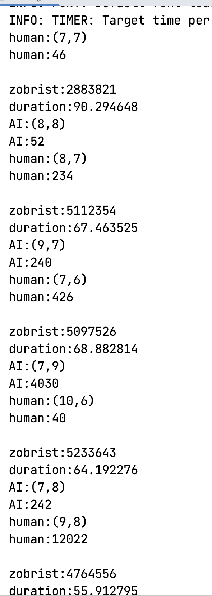
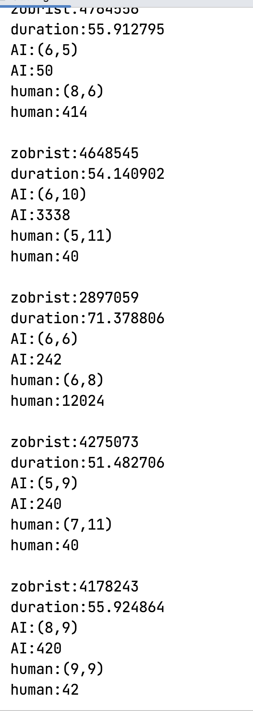
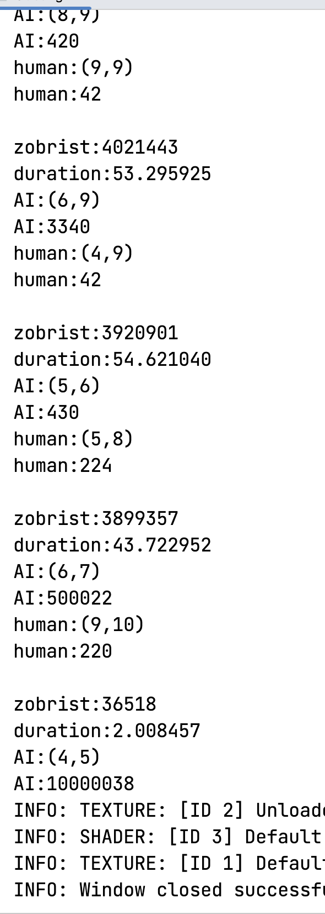

前10步到15步，决策时间约为40s；随着棋盘上已有的棋子增多，决策时间变少，15步后约降到30s以下。但即便步数相同，决策时间随局面不同也会有一定差异，且AI执先后手时时间会有所不同，AI先手时时间会比后手稍长。

### 棋力
- 由于估值模块中棋型的设置比较精细，所以估分较为准确。在评分上的主要瓶颈在于不同棋型分值的设置，分值不同会明显影响AI决策。比如，开始时设置冲四与活三分值相同，但此时AI会倾向于冲四，出现一些比较盲目的行为；将冲四分值略为调低后盲目冲四明显减少。
- 设置的搜索深度为5层，若设置为6层则思考过久，4层则有损棋力。因为深度为5层时时间可以接受并且有一定棋力所以设为5层。

在和我对弈时，7局中AI能赢3局左右，如下图（1月30日前后下的7局中的6局）：<br>


但该评价方式较为主观，首先不能确定我自身棋力，其次我思考深度也不固定，有时认真则思考较深，有时只抱着测试的态度则思考较浅。所以列出对AI的两个要求来评价棋力：

#### 基础要求
- 玩家活三、冲四后会阻止；
- 落子符合正常逻辑，不出现完全莫名其妙看不出用意的落子；
- 在防住玩家的前提下，扩大AI的优势。

以上3点是棋局能正常进行下去的保障，也就是AI不会出现智障行为。

#### 进阶要求：
- 能察觉到玩家后几步的进攻用意。比如，当玩家开始算杀时能及时阻止。为此采取案例分析的方式，如下图：<br>
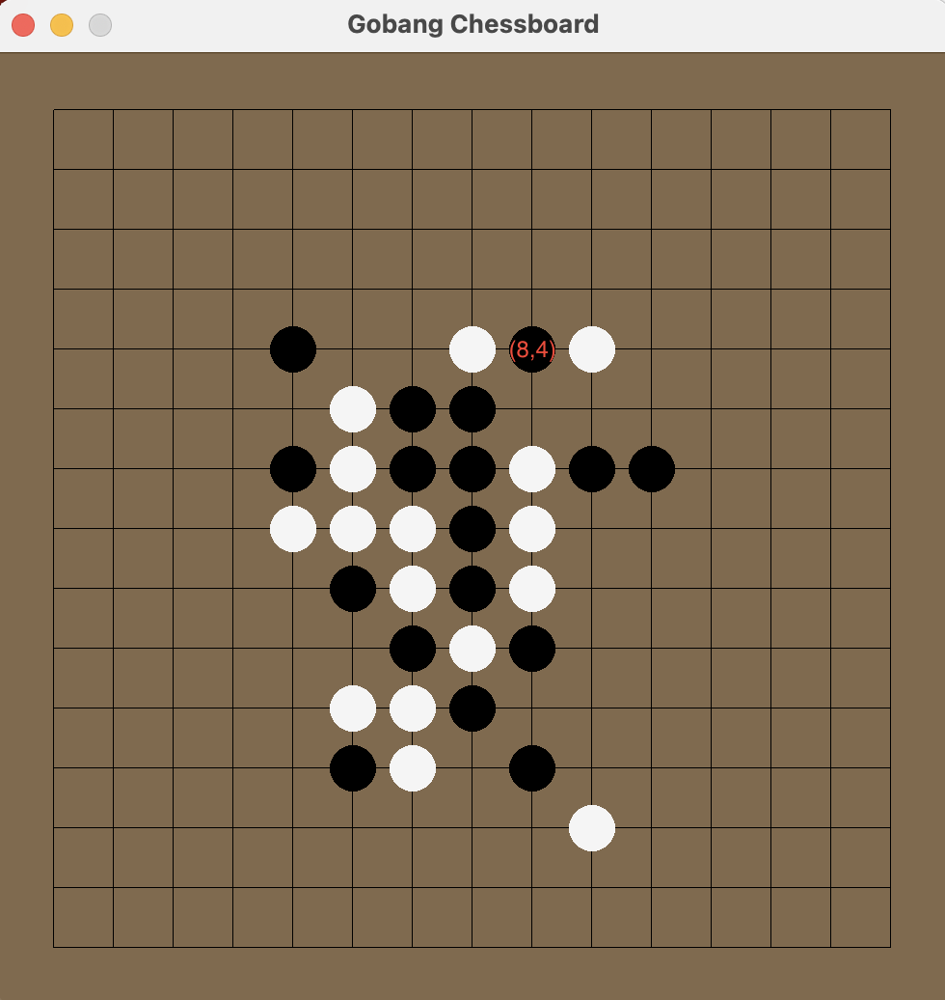
（左上角为坐标原点，向右、向上x、y坐标分别增大）
玩家最新落子是（9，4），实际上是玩家算杀的第一步。算杀的具体内容是：
1. 若落子（5，4），则形成冲四，AI必在（5，3）堵截；
2. 若落子（8，4），则形成冲四，AI必在（8，5）堵截；
3. 由上，若先落子（9，4）且AI没有在（5，3）或（8，5）堵截，则玩家可连续下（5，4），（8，4），（6，4）成五而不可能再受干扰。
 
从落下（9，4）开始截止到成五的落子，玩家走了4步，AI则走3步，相当于往后思考7层。如果AI棋力不够，则在玩家下（9，4）时不会看出玩家的算杀，一旦没有提前在（5，3）或（8，5）堵截，则玩家是必胜局面。虽然AI思考深度为5层，即达不到玩家最终成五的局面，但仍然成功提前堵截，说明AI有一定棋力且目前的各算法有效。

- 能组织目的更为隐晦的进攻，即不会盲目活二-活三-冲四。<br>

上图为上一个案例分析的结果，最终AI胜利。可以看到AI的制胜棋是一个冲四和活三的交叉，也即组织了目的更为隐晦的进攻。

---
## 尾声
实验报告主体已经结束，更详细的代码分析在源码的注释中，下面就是一些辛酸史了。整个Gobang程序到现在的形态经历了无数的修改和调试，其中许多问题开始时都让人感觉莫名其妙而且调试很长时间也不能发现出错原因。其实整个实验过程最有价值的地方应该在于算法的修改和错误的调试。

刚开始时我没有“小步快走”的概念，一口气把整个程序写完了，尽管脑中觉得不会有问题，结果调试时AI连一个子都落不下。最初还是用VS和Eazyx写的，后来又转到Clion和Raylib。从一个子都落不下到终于能看见“you win”和“you lose”的棋局结束语，中间不知道看到了多少次`modify freed object`还有`已触发断点`...下面这两张图更是常客：<br>
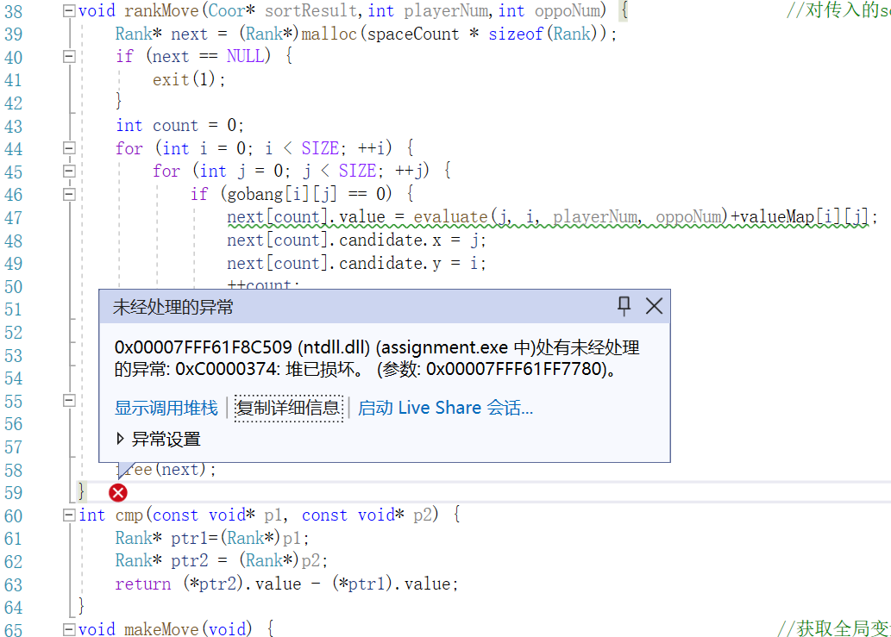
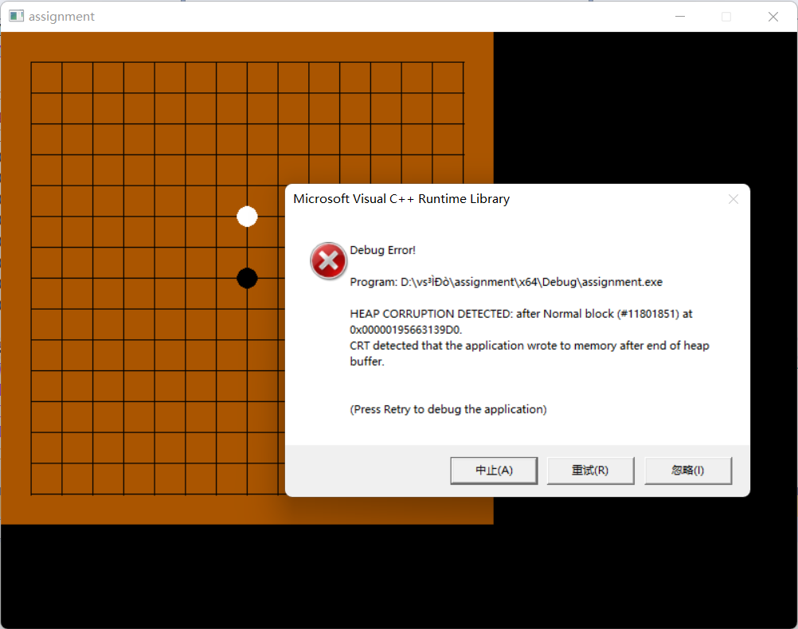
<br>
最初的估值函数我采取了大量if语句的形式，我甚至也写过遍历整个棋盘的估值函数，结果if版本的估值函数总是不满意，开始时删掉几百行代码重写，之后因为运行速度太不理想，最终才想到了开局初始化棋型数组的方式。当初还专门为if语句的分支和嵌套打了草稿...大量重复但又不能出错的工作，现在想来真是一把泪：
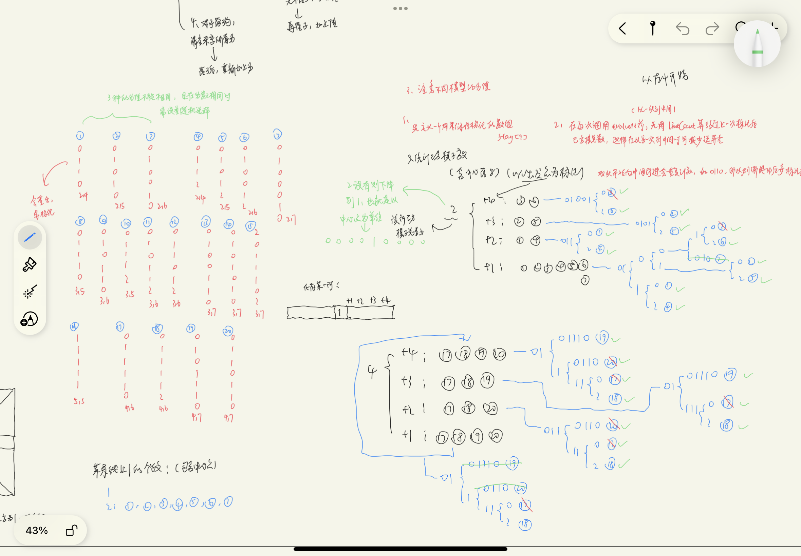
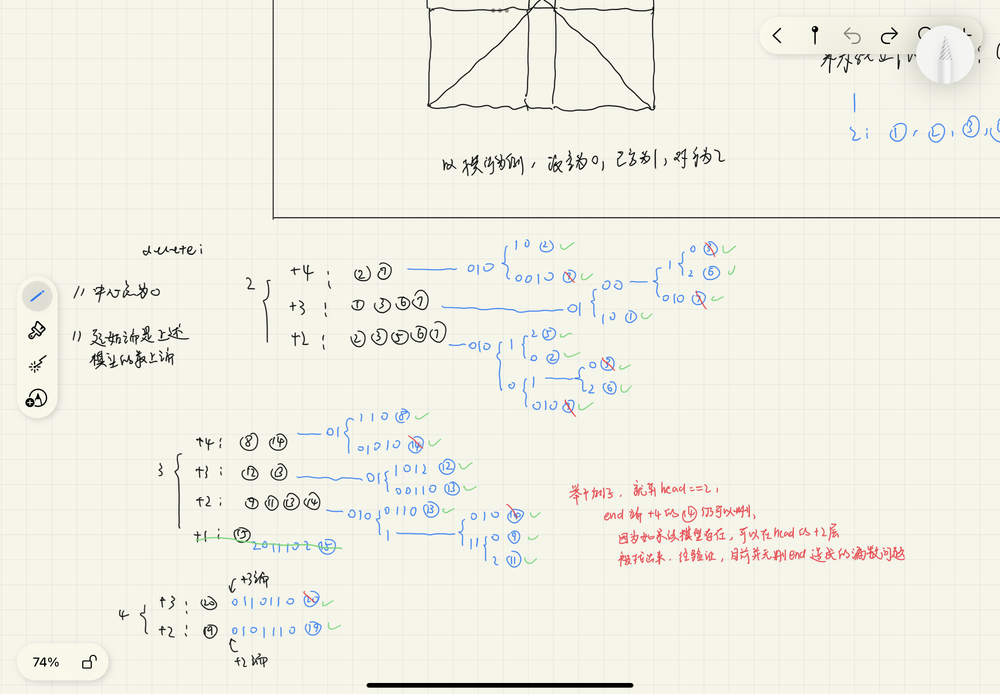
<br>
还有许多小问题，比如刚开始应用zobrist缓存时总是会出现莫名其妙的走法，因为觉得很可能是存储方式不够好导致出现了哈希冲突所以修改了存储哈希表的逻辑，于是这个问题才得以解决。记得俸老师提到过一个说法，大意是设计程序耗时比明确程序目的多，写代码耗时又比设计程序多，调试的耗时则又比写代码要多得多。通过这个五子棋AI的完成，我自认为很惨痛地体会到了最后一句话了...

附上原先在本地的一些git记录：

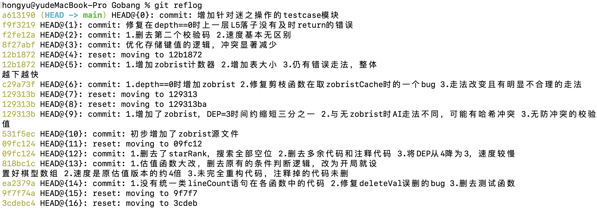

---
## 参考文献
- [Zobrist hashing - Wikipedia](https://en.wikipedia.org/wiki/Zobrist_hashing)
- [JavaScript中国象棋程序（7） - 置换表](https://www.cnblogs.com/royhoo/p/6425858.html)
- [基本搜索方法——Alpha-Beta搜索](https://www.xqbase.com/computer/search_alphabeta.htm)
- [javascript gobang AI](https://github.com/lihongxun945/gobang)