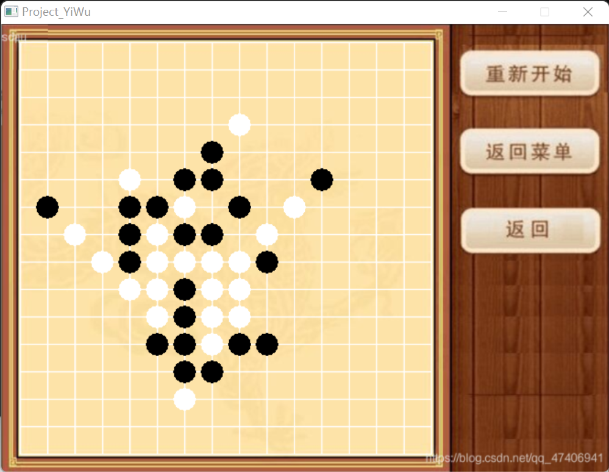

# 写在前面

“弈棋悟道”是某次**柯洁**在接受采访时致年轻人的寄语，受此启发我便决定将这次的五子棋AI实验命名为**弈悟计划**。

由于本人水平有限，遂把重点放在了AI水平的优化上，因此界面和一些细微的功能就稍显简陋。

在本实验中，棋盘大小为$16\times 16$、**没有**禁手规则、默认玩家执黑先手、无时间限制，同时只支持重新开始但不支持悔棋功能~~（落子无悔嘛）~~。

但为了供玩家复盘对局有记录对局落子轨迹的功能，在对局结束后会生成*trail.txt*文件供查看。

最后的成果个人也比较满意，大概有略强于普通人的棋力水平了。

---

# 设计思路

## 关于GUI部分

使用**EasyX**图形库来绘制棋子，棋盘和菜单的图片就直接用网图了。

同时支持通过检测鼠标点击位置来进行落子，力求一个方便。

这部分的难点在于控制参数来让棋子精准地落在格点上，要多次修改具体的像素值来力求比较好的效果。

关于这部分的代码实现详见代码中的```Menu::ChessBoard```、```Menu::Display```、```Play::PlayGame```等函数模块。

## 关于AI算法部分

这部分的算法在参考了网上的教程之后，确认了两个大致方向**启发式搜素**或**蒙特卡洛树。**

最后考虑到实现难度和个人代码水平，遂选择了比较简单的启发式搜素的算法。

算法的核心就是通过**估价函数**给不同的棋局状态进行打分。

AI会在所有可能的合法后继状态中选择一种对自己最有利的局面（打分最高的状态）。

然后再考虑假定人类一方也会用同样的想法在该局面的所有可能的合法后继状态选择一个对人类最有力的局面。

这种人类和AI相继行动的搜索过程可以用**Min-Max搜索**来实现。

而通过搜索层数的加深，AI的算力就会不断增强，但与此同时每一步的时间开销也会显著增加。

我们可以通过调节搜索深度（比如AI下一步后再考虑人类走一步就算两层搜素深度），来力求棋力和时间的平衡。

而这部分的具体模块划分如下：

### 状态扩展函数

其核心目标就是寻找某个局面的所有后继可能的合法后继状态。

虽然理论上我们在选择落子的时候可以在棋盘的任意一个空位，但实战中我们一般不会凭空乱下。

因此我们可以建立一个大前提，AI的落子以及它预设的玩家的落子都落在现有棋局的附近，而不会跑的太远。

具体地，我们设立一个扩展范围常量```MAX_DIS```，规定每次落子的位置在距离它**切比雪夫距离**小于等于```MAX_DIS```的位置上必须要有棋子（不论敌我）。

关于这部分的代码实现详见代码中的```generate```函数模块。

### 评估函数

其核心目标就是对棋局的状态进行打分。

考虑我们如何公式化地评价一个棋局对某一方的优劣，直观地，我们可以统计并根据连子的数量来打分。

并且对于上下左右和主副对角线，我们都要分别这六个方向上的连子情况。

同时有过实战经验的人一定知道，对手的活三和活二带来的防守压力是完全不同的，因此我们还要对不同的棋型设计基础分值。

具体地，作如下的基础分值评估：

- 成五，100000000
- 活四，10000
- 活三，1000
- 活二，100
- 活一，10

而对于有一边被其它棋子堵住（或者被边界堵住）的棋子，则对应的分数降一档：

- 死四，1000
- 死三，100
- 死二，10

根据上面的想法我们只要把棋盘根据不同方向划分为一个个线性单元，然后分别统计即可。

关于这部分的代码实现详见代码中的```evaluate```和```calc```函数模块。

### α-β剪枝

由于一般情况下Min-Max搜索树上的状态数很多，因此通过舍弃一些显然不优秀的搜素方向来优化运行效率。

我们可以将搜索树上的节点分为三类：

1. 已遍历完自身及其子树，得到了自身的估值的点。不妨称为**A类点**。
2. 未完全遍历完自身子树，但已有至少一个儿子已完全遍历并确定了估值，即儿子中至少有一个A类点。我们称这类点为**B类点**
3. 未遍历该点或该点的儿子中未有已确定估值的，即无A类点儿子。我们称这类点为**C类点**（C类点可能有B类点儿子）。

而α-β剪枝就是针对B类点的剪枝操作，虽然B类点的自身的估值尚未确定，但由于其部分儿子的估值已经确定了，所以可以根据这些信息为B类点的估值范围做出限制，并依此排除不可能的分支。

而在实际运用中，通过引入α-β剪枝，可以将需要计算的状态数缩减到原来的$\frac{1}{10}$左右，极大地优化了算法的性能。

关于这部分的代码实现详见代码中的```min_search```和```max_search```函数模块。

---

# 性能改进

## 启发式搜索函数

由于α-β剪枝的复杂度很依赖于遍历的顺序，因此调整后继状态的搜索顺序使得我们可以多减去一些状态就成了优化性能的关键所在。

比如在Min搜索中，如果我们先搜索出了一个得分比较小的局面，那么显然后面的很多状态都可以被减去，而Max搜索中的情况同理。

因此我们可以通过给所有后继状态也进行评估，根据这个分数将后继状态排序后再进行搜索来大大优化性能。

关于这部分的代码实现详见代码中的```min_search```和```max_search```函数模块。

## 优化评估函数的性能

由于前面实现的评估函数调用一次的复杂度大概就是$O(16^3)$级别的，再乘上在评估后继状态时庞大的状态数的话就会导致程序的运行时间大大增长。

但我们仔细观察发现在实现上面的“给所有后继状态进行评估”的过程中，其实不同的状态之间只有一颗棋子的落点不同。

因此我们可以只考虑这颗棋子所带来的局面影响，而不用重复计算其它无关棋子的得分了（因为所有的待排序的后继状态的这些分数都是一样的）。

因此这部分的复杂度一下就变成了原来的$\frac{1}{16}$了，性能有了巨大的提升。

关于这部分的代码实现详见代码中的```evaluate_point```函数模块。

## 通过Zobrist来存储重复状态数

由于我们在搜索过程中会有很多重复的搜索过程，比如：

```
[7,7],[8,7],[7,6],[7,9]
```

和下面这种的走法只是顺序不同 ，最终走出来的局面是一样的：

```
[7,6],[7,9],[7,7],[8,7]
```

前面的算法在遇到这两种情况时，会分别给两种状态都打一次分，而其实我们完全可以把这两种状态归到同一类中，这样后面遇到这种**本质相同**的状态时就可以直接调用了。

Zobrist 是一个快速Hash算法，非常适合用在各种棋类游戏中，其具体实现如下：

- 初始化两个 `Zobrist[16][16]` 的二维数组，分别用于黑棋和白棋的落子，同时设置一个键值来表示当前状态。
- 上述数组的每一个都填上一个```unsigned long long```范围的随机数。
- 每下一步棋，就用当前键值异或Zobrist数组里对应位置的随机数，得到的结果即为新的键值。如果是删除棋子（悔棋），则再异或一次即可。

因此我们只要在每次走棋的时候进行一次异或操作即可，根据文献证明这种做法可以保证极高的正确率将本质相同的操作归为一类。

关于这部分的代码实现详见代码中的```Zobrist```函数模块以及所有落子的代码部分。

## 针对后盘的防守模块

由于棋局战至中后盘后每次搜索的状态数就会激增，AI的应对速度就会越来越慢。

而很多时候当人类一方下出必须防守的棋型时（比如**死四，活三**），一般情况下电脑是必须要去防守的，不存在别的选项。

因此在每次AI进行搜索前可以预先判断下是否存在必须要防守的棋型，如果有的话就直接选择防守就可以省去搜索部分的时间了。

关于这部分的代码实现详见代码中的```defense```函数模块。

---

# 成果评价

## 运行界面



## 性能评估

对局前期大概可以做到0.5s~1s的落子速度。

中后盘随着局面复杂程度上升，思考时间大致在5s左右。

可执行程序的大小为$6120 KB$。

## AI的棋力评估

大致为略强于普通人的水平（一般普通人思考四步后的情况，AI有搜索六步以后的能力）。

在模拟对局测试中刚开始个人被AI杀得体无完肤，后面找到了擅长五子棋的同学可以和AI战成平手。

总体来看棋力水平还是不错的。

---

# 代码展示

## main.cpp

```cpp
#define _CRT_SECURE_NO_WARNINGS 1
#include "YiWu.h"
#include<cstdio>

int main() {
    Menu m;
    m.Display();
    return 0;
}
```

## Yiwu.h

```cpp
#include <graphics.h>
#include <conio.h>
#include <windows.h>
#define _CRT_SECURE_NO_WARNINGS 1

class Menu {
public:
    void Display();
    void ChessBoard(MOUSEMSG m);
};

class Play {
public:
    void TwoPlayerGame(MOUSEMSG m);
    void ComputerUserGame(MOUSEMSG m);
    void buttonRingth(MOUSEMSG m, MOUSEMSG ms, int win); //判断是否点击右侧工具栏
    void displayWin(int n1, int
                    n2);//显示哪一方赢了,n1为0表示双人为1表示人机，n2为0表示黑、人为1表示白、机
    void PlayGame(MOUSEMSG ms);
    int Win();
};

```

## Yiwu.cpp

```cpp
#define _CRT_SECURE_NO_WARNINGS 1
#include "YiWu.h"
#include <iostream>
#include <vector>
#include <algorithm>
#include <cstdio>
#include <cstdlib>
#include <ctime>
#include <map>
using namespace std;

typedef unsigned long long ULL;

FILE *printer = fopen("trail.txt", "w");

int a[16][16] = {0};

ULL cur;

const int INF = 1e9;

//0空地，1玩家落子，2电脑落子


//1:BLACK 2:WHITE

ULL seed1[16][16], seed2[16][16];
void Zobrist(void) {
    srand(time(0));

    for (int i = 0; i < 16; ++i)
        for (int j = 0; j < 16; ++j) {
            seed1[i][j] = 1LL * rand() * rand() * rand() * rand();
            seed2[i][j] = 1LL * rand() * rand() * rand() * rand();
        }
}

void place1(int col, int hang, int lie) {
    if (col == 1)
        setfillcolor(BLACK);
    else
        setfillcolor(WHITE);

    solidcircle(lie, hang, 12);
    a[hang / 30][lie / 30] = col;
    cur ^= seed1[hang / 30][lie / 30];
}

void place2(int col, int x, int y) {
    setfillcolor(WHITE);
    a[x][y] = col;
    cur ^= seed2[x][y];
    solidcircle(20 + y * 30, 20 + x * 30, 12);
}

/*
    对棋局进行评分，分数=AI得分-玩家得分
成五，100000000
活四, 10000
活三，1000
活二，100
活一，10

死四,1000
死三，100
死二，10
*/

const int live[5] = {0, 10, 100, 1000, 10000};
const int dead[5] = {0, 1, 10, 100, 1000};
const int rush[6] = {0, 0, 5, 50, 500, 10000};
int calc(vector <int> v, int col) {
    v.push_back(0);

    for (int i = v.size() - 1; i > 0; --i)
        v[i] = v[i - 1];

    v[0] = 3 - col;
    v.push_back(3 - col);
    int lst = 0, ret = 0;

    for (int i = 1; i < v.size(); ++i) {
        if (v[i] != col) {
            int num = i - 1 - lst;

            if (num == 5)
                ret += 100000000;

            if (!v[lst] && !v[i])
                ret += live[num];
            else if (!v[lst] || !v[i])
                ret += dead[num];

            lst = i;
        } else if (v[i] == 0 && v[i - 1] == col && v[i + 1] == col) {
            int L;

            for (L = i - 1; L > 0 && v[L] == col; --L);

            int R;

            for (R = i + 1; R < v.size() && v[R] == col; ++R);

            ret += rush[min(i - 1 - L + R - i - 1, 5)];
        }
    }

    return ret;
}

int evaluate(void) {
    int ret = 0;
    vector <int> v;

    for (int i = 0; i < 16; ++i) {
        v.clear();

        for (int j = 0; j < 16; ++j)
            v.push_back(a[i][j]);

        ret += calc(v, 2) - calc(v, 1);
    }

    for (int j = 0; j < 16; ++j) {
        v.clear();

        for (int i = 0; i < 16; ++i)
            v.push_back(a[i][j]);

        ret += calc(v, 2) - calc(v, 1);
    }

    for (int i = 0; i < 16; ++i) {
        v.clear();

        for (int x = i, y = 0; x < 16 && y < 16; ++x, ++y)
            v.push_back(a[x][y]);

        ret += calc(v, 2) - calc(v, 1);
    }

    for (int j = 1; j < 16; ++j) {
        v.clear();

        for (int x = 0, y = j; x < 16 && y < 16; ++x, ++y)
            v.push_back(a[x][y]);

        ret += calc(v, 2) - calc(v, 1);
    }

    for (int i = 0; i < 16; ++i) {
        v.clear();

        for (int x = i, y = 15; x < 16 && y >= 0; ++x, --y)
            v.push_back(a[x][y]);

        ret += calc(v, 2) - calc(v, 1);
    }

    for (int j = 0; j < 15; ++j) {
        v.clear();

        for (int x = 0, y = j; x < 16 && y >= 0; ++x, --y)
            v.push_back(a[x][y]);

        ret += calc(v, 2) - calc(v, 1);
    }

    return ret;
}

int evaluate_point(int x, int y) {
    int ret = 0;
    vector <int> v;
    v.clear();

    for (int i = 0; i < 16; ++i)
        v.push_back(a[x][i]);

    ret += calc(v, 2) - calc(v, 1);
    v.clear();

    for (int i = 0; i < 16; ++i)
        v.push_back(a[i][y]);

    ret += calc(v, 2) - calc(v, 1);
    int stx = x, sty = y;

    while (stx > 0 && sty > 0)
        --stx, --sty;

    v.clear();

    for (; stx < 16 && sty < 16; ++stx, ++sty)
        v.push_back(a[stx][sty]);

    ret += calc(v, 2) - calc(v, 1);
    stx = x, sty = y;

    while (stx > 0 && sty < 15)
        --stx, ++sty;

    v.clear();

    for (; stx < 16 && sty >= 0; ++stx, --sty)
        v.push_back(a[stx][sty]);

    ret += calc(v, 2) - calc(v, 1);
    return ret;
}

struct Data {
    int x, y, val;
};

vector <Data> generate(int dep) {
    vector <Data> v;

    for (int i = 0; i < 16; ++i)
        for (int j = 0; j < 16; ++j) {
            if (a[i][j])
                continue;

            bool flag = 0;

            for (int p = max(0, i - 1); p <= min(15, i + 1) && !flag; ++p)
                for (int q = max(0, j - 1); q <= min(15, j + 1) && !flag; ++q)
                    if (a[p][q])
                        v.push_back({i, j, 0}), flag = 1;

            if (dep < 2 || flag)
                continue;

            for (int p = max(0, i - 2); p <= min(15, i + 2) && !flag; ++p)
                for (int q = max(0, j - 2); q <= min(15, j + 2) && !flag; ++q)
                    if (a[p][q])
                        v.push_back({i, j, 0}), flag = 1;
        }

    return v;
}

bool cmp_min(const Data &A, const Data &B) {
    return A.val < B.val;
}
bool cmp_max(const Data &A, const Data &B) {
    return A.val > B.val;
}

const int MAX_DEEP = 6, CK_DEEP = 12, MAX_DIS = 1;

int nxt_x, nxt_y, cnt;

bool count(int x, int y, int dx, int dy, int num, int col) {
    for (int i = 1; i <= num; ++i) {
        int nx = x + i * dx, ny = y + i * dy;

        if (nx < 0 || nx > 15 || ny < 0 || ny > 15)
            return 0;

        if (a[nx][ny] != col)
            return 0;
    }

    return 1;
}

void defense(void) {
    bool flag = 0;

    for (int i = 0; i < 16 && !flag; ++i)
        for (int j = 0; j < 16 && !flag; ++j) {
            if (a[i][j])
                continue;

            for (int k = 4; k >= 0 && !flag; --k) {
                if (count(i, j, -1, 0, 4, 1) && count(i, j, 1, 0, 4 - k, 1))
                    nxt_x = i, nxt_y = j, flag = 1;

                if (count(i, j, 1, 0, 4, 1) && count(i, j, -1, 0, 4 - k, 1))
                    nxt_x = i, nxt_y = j, flag = 1;

                if (count(i, j, 0, -1, 4, 1) && count(i, j, 0, 1, 4 - k, 1))
                    nxt_x = i, nxt_y = j, flag = 1;

                if (count(i, j, 0, 1, 4, 1) && count(i, j, 0, -1, 4 - k, 1))
                    nxt_x = i, nxt_y = j, flag = 1;

                if (count(i, j, -1, -1, 4, 1) && count(i, j, 1, 1, 4 - k, 1))
                    nxt_x = i, nxt_y = j, flag = 1;

                if (count(i, j, -1, 1, 4, 1) && count(i, j, 1, -1, 4 - k, 1))
                    nxt_x = i, nxt_y = j, flag = 1;

                if (count(i, j, 1, -1, 4, 1) && count(i, j, -1, 1, 4 - k, 1))
                    nxt_x = i, nxt_y = j, flag = 1;

                if (count(i, j, 1, 1, 4, 1) && count(i, j, -1, -1, 4 - k, 1))
                    nxt_x = i, nxt_y = j, flag = 1;
            }
        }
}

int min_search(int dep, int alpha, int beta, ULL sts);
int max_search(int dep, int alpha, int beta, ULL sts);

map <ULL, int> status;

int min_search(int dep, int alpha, int beta, ULL sts) { //col=1
    ++cnt;

    if (dep <= 0) {
        if (status.count(sts))
            return status[sts];

        return status[sts] = evaluate();
    }

    vector <Data> nxt = generate(MAX_DIS);

    for (int i = 0; i < nxt.size(); ++i) {
        int pre = evaluate_point(nxt[i].x, nxt[i].y);
        a[nxt[i].x][nxt[i].y] = 1;
        nxt[i].val = evaluate_point(nxt[i].x, nxt[i].y) - pre;
        a[nxt[i].x][nxt[i].y] = 0;
    }

    sort(nxt.begin(), nxt.end(), cmp_min);
    int best = INF;

    for (auto it : nxt) {
        int x = it.x, y = it.y, val = it.val;
        a[x][y] = 1;
        sts ^= seed1[x][y];
        int cur = max_search(dep - 1, min(best, alpha), beta, sts);
        a[x][y] = 0;
        sts ^= seed1[x][y];

        if (cur < best)
            best = cur;

        if (best < beta)
            break; //alpha-beta cut
    }

    return best;
}
int max_search(int dep, int alpha, int beta, ULL sts) { //col=2
    ++cnt;

    if (dep <= 0) {
        if (status.count(sts))
            return status[sts];

        return status[sts] = evaluate();
    }

    vector <Data> nxt = generate(MAX_DIS);

    for (int i = 0; i < nxt.size(); ++i) {
        int pre = evaluate_point(nxt[i].x, nxt[i].y);
        a[nxt[i].x][nxt[i].y] = 2;
        nxt[i].val = evaluate_point(nxt[i].x, nxt[i].y) - pre;
        a[nxt[i].x][nxt[i].y] = 0;
    }

    sort(nxt.begin(), nxt.end(), cmp_max);
    int best = -INF, tx, ty;

    for (auto it : nxt) {
        int x = it.x, y = it.y, val = it.val;
        a[x][y] = 2;
        sts ^= seed2[x][y];
        int cur = min_search(dep - 1, alpha, max(beta, best), sts);
        a[x][y] = 0;
        sts ^= seed2[x][y];

        if (cur > best)
            best = cur, tx = x, ty = y;

        if (best > alpha)
            break; //alpha-beta cut
    }

    if (dep == MAX_DEEP)
        nxt_x = tx, nxt_y = ty;

    return best;
}

void trail(int x, int y, int col) {
    if (col == 1)
        fprintf(printer, "Play Set: Row %d Col %d\n", x, y);
    else
        fprintf(printer, "AI Set: Row %d Col %d\n", x, y);
}

void Play::PlayGame(MOUSEMSG ms) {
    //玩家走子
    int success = 1;

    while (success) {
        ms = GetMouseMsg();

        for (int lie = 20; lie <= 490; lie += 30) {
            if (ms.x <= lie + 15 && ms.x >= lie - 15) {
                for (int hang = 20; hang <= 490; hang += 30) {
                    if (ms.y <= hang + 15 && ms.y >= hang - 15) {
                        if (a[hang / 30][lie / 30] == 0) {
                            place1(1, hang, lie);
                            success = 0;
                            trail(hang / 30, lie / 30, 1);
                            break;
                        }
                    }
                }
            }
        }
    }

    int win = Play().Win();

    if (win == 1) {
        //黑棋赢
        return;
    }

    //AI走子
    nxt_x = nxt_y = -1;
    defense();

    if (!~nxt_x) {
        if (!~nxt_x) {
            cnt = 0;
            max_search(MAX_DEEP, INF, -INF, cur);
            //printf("Have tried %d status\n", cnt);
        }
    }

    place2(2, nxt_x, nxt_y);
    trail(nxt_x, nxt_y, 2);
    win = Play().Win();

    if (win == 2) {
        //黑棋赢
        return;
    }
}

void Menu::Display() {
    //初始化绘图窗口
    initgraph(416, 624, SHOWCONSOLE);

    /*设置背景图*/
    IMAGE img;
    setaspectratio(1.1, 1);
    //从图片文件获取图像（图像的image指针，图像名，资源名称，图片的拉伸宽度、高度，是否自适应图片大小）
    loadimage(&img, "init.png", 377, 624, 1);
    putimage(0, 0, &img);

    /*控制鼠标移动操作*/
    MOUSEMSG m;//鼠标操作

    while (true) {
        m = GetMouseMsg();//获取鼠标消息

        //左键按下：WM_LBUTTONDOWN
        if (m.uMsg == WM_LBUTTONDOWN && (m.x >= 72 && m.x <= 307 && m.y >= 340 && m.y <= 400
                                         || m.x >= 72 && m.x <= 307 && m.y >= 420 && m.y <= 480)) {
            //uMsg鼠标信息  WM_MOUSEMOVE鼠标移动消息  x y表示鼠标位置坐标
            if (m.x >= 72 && m.x <= 307 && m.y >= 340 && m.y <= 400) {
                setlinecolor(YELLOW);
                setlinestyle(PS_SOLID | PS_JOIN_ROUND, 2);
                //空心矩形框
                rectangle(72, 340, 300, 400);
            } else if (m.x >= 72 && m.x <= 307 && m.y >= 420 && m.y <= 480) {
                setlinecolor(YELLOW);
                //空心矩形框
                rectangle(72, 420, 300, 480);
            }

            Sleep(500);
            //清除屏幕内容
            cleardevice();
            //休眠五秒
            Sleep(300);
            //关闭窗口
            closegraph();
            Menu().ChessBoard(m);
            break;
        }
    }
}

void Menu::ChessBoard(MOUSEMSG m) {
    //初始化绘图窗口
    initgraph(665, 490, SHOWCONSOLE);

    /*设置棋盘背景背景图*/
    IMAGE img;
    //缩放因子，例如设置宽度为100的单元格，实际的绘制宽度为（100*缩放因子）
    //setaspectratio(1.1, 1);
    //从图片文件获取图像（图像的image指针，图像名，资源名称，图片的拉伸宽度、高度，是否自适应图片大小）
    loadimage(&img, "chessborad.png", 665, 490);
    putimage(0, 0, &img);

    //绘制棋盘
    while (true) {
        for (int i = 20; i <= 470; i += 30) {
            setlinecolor(WHITE);
            line(20, i, 470, i);
            line(i, 20, i, 470);
        }

        //如果左键双人，跳入双人游戏
        if (m.uMsg == WM_LBUTTONDOWN && m.x >= 72 && m.x <= 307 && m.y >= 420 && m.y <= 480) {
            Play().TwoPlayerGame(m);
        } else {
            Play().ComputerUserGame(m);
        }
    }
}

void Play::buttonRingth(MOUSEMSG m, MOUSEMSG ms, int win) {
    if (ms.x >= 500 && ms.x <= 655 && ms.y >= 30 && ms.y <= 80) {
        memset(a, 0, sizeof(a));
        //重新开始
        setlinecolor(RED);
        //空心矩形框
        rectangle(500, 30, 655, 80);
        Sleep(300);
        Menu().ChessBoard(m);
    } else if (ms.x >= 500 && ms.x <= 655 && ms.y >= 115 && ms.y <= 165) {
        memset(a, 0, sizeof(a));
        //返回菜单
        setlinecolor(RED);
        //空心矩形框
        rectangle(500, 115, 655, 165);
        Sleep(300);
        Menu().Display();
    } else if (win == 0 && ms.x >= 500 && ms.x <= 655 && ms.y >= 200 && ms.y <= 250) {
        //悔棋
        setlinecolor(RED);
        //空心矩形框
        rectangle(500, 200, 655, 250);
    }
}
void Play::displayWin(int n1, int n2) {
    memset(a, 0, sizeof(a));
    //显示哪一方赢了,n1为0表示双人为1表示人机，n2为0表示黑、人为1表示白、机
    IMAGE img;

    // 读取图片至绘图窗口
    if (n1 == 0 && n2 == 0)
        loadimage(&img, "victory.jpg", 700, 600);

    if (n1 == 0 && n2 == 1)
        loadimage(&img, "defeat.jpg", 700, 600);

    if (n1 == 1 && n2 == 0)
        loadimage(&img, "victory.jpg", 700, 600);

    if (n1 == 1 && n2 == 1)
        loadimage(&img, "defeat.jpg", 700, 600);

    putimage(0, 0, &img);

    MOUSEMSG m;//鼠标操作

    while (1) {
        m = GetMouseMsg();

        if (m.uMsg == WM_LBUTTONDOWN && m.x >= 215 && m.x <= 270 && m.y >= 285 && m.y <= 320) {
            setlinecolor(YELLOW);
            //空心矩形框
            rectangle(215, 285, 270, 320);
            Sleep(300);
            Menu().Display();
            break;
        } else if (m.uMsg == WM_LBUTTONDOWN)
            exit(0);
    }
}

void Play::TwoPlayerGame(MOUSEMSG m) {
    int win = 0;
    int play1 = 1, play2 = 0;
    MOUSEMSG ms;

    //一直获取鼠标信息，判断操做
    while (win == 0) {
        //判断是否点击右侧工具栏或者棋盘
        ms = GetMouseMsg();

        if (ms.uMsg == WM_LBUTTONDOWN) {
            //判断是否点击右侧工具栏
            buttonRingth(m, ms, win);

            //判断是否点击棋盘
            for (int lie = 20; lie <= 490; lie += 30) {
                if (ms.x <= lie + 15 && ms.x >= lie - 15) {
                    for (int hang = 20; hang <= 490; hang += 30) {
                        if (ms.y <= hang + 15 && ms.y >= hang - 15) {
                            if (play1 == 1 && a[hang / 30 - 1][lie / 30 - 1] == 0) {
                                place1(1, hang, lie);
                                play1 = 0;
                                break;
                            }

                            if (play1 == 0 && a[hang / 30 - 1][lie / 30 - 1] == 0) {

                                place1(2, hang, lie);
                                play1 = 1;
                                break;
                            }
                        }
                    }
                }
            }

            //判断玩家是否赢
            //DEBUG
            /*printf("%d\n",evaluate());
            if (play1==1)
            {
                vector <pair<int,int>> nxt=generate(2);
                for (auto it:nxt)
                {
                    printf("%d %d %d\n",it.x,it.y,it.val);
                }
            }*/
            win = Play().Win();

            if (win == 1) {
                //黑棋赢
                displayWin(0, 0);
                break;
            } else if (win == 2) {
                //白棋赢
                displayWin(0, 1);
                break;
            }
        }
    }
}

void Play::ComputerUserGame(MOUSEMSG m) {
    int win = 0;

    Zobrist();

    MOUSEMSG ms;

    //一直获取鼠标信息，判断操做
    while (win == 0) {
        //判断是否点击右侧工具栏或者棋盘
        ms = GetMouseMsg();

        if (ms.uMsg == WM_LBUTTONDOWN) {
            //判断是否点击右侧工具栏
            buttonRingth(m, ms, win);
            //判断是否点击棋盘并且判断是否该玩家落子
            Play::PlayGame(ms);
            //判断玩家是否赢
            win = Play().Win();

            if (win == 1) {
                //人赢
                displayWin(1, 0);
                break;
            } else if (win == 2) {
                //电脑赢
                displayWin(1, 1);
                break;
            }
        }
    }
}


int Play::Win() {
    int win = 0;

    //判断是否赢
    for (int j = 0; j < 16 && (win == 0); j++) {
        for (int i = 0; i < 16; i++) {

            if ((a[j][i] == 1 && a[j][i + 1] == 1 && a[j][i + 2] == 1 && a[j][i + 3] == 1 && a[j][i + 4] == 1)
                    || (a[i][j] == 1 && a[i + 1][j] == 1 && a[i + 2][j] == 1 && a[i + 3][j] == 1 &&
                        a[i + 4][j] == 1)) { //横纵是5个子play1 win
                win = 1;
                Sleep(100);
                break;
            }

            if ((a[j][i] == 2 && a[j][i + 1] == 2 && a[j][i + 2] == 2 && a[j][i + 3] == 2 && a[j][i + 4] == 2)
                    || (a[i][j] == 2 && a[i + 1][j] == 2 && a[i + 2][j] == 2 && a[i + 3][j] == 2 &&
                        a[i + 4][j] == 2)) { //横纵是5个子play2 win
                win = 2;
                Sleep(100);
                break;
            }
        }
    }

    for (int j = 0; j < 12 && (win == 0); j++) {
        for (int i = 0; i < 12; i++) {
            if (a[j][i] == 1 && a[j + 1][i + 1] == 1 && a[j + 2][i + 2] == 1 && a[j + 3][i + 3] == 1 &&
                    a[j + 4][i + 4] == 1) { //向右倾斜时候play1 win
                win = 1;
                Sleep(100);
                break;

            }

            if (a[j][i] == 2 && a[j + 1][i + 1] == 2 && a[j + 2][i + 2] == 2 && a[j + 3][i + 3] == 2 &&
                    a[j + 4][i + 4] == 2) { //向右倾斜时候play2 win
                win = 2;
                Sleep(100);
                break;
            }
        }

        for (int i = 4; i < 16 && (win == 0); i++) {
            if (a[j][i] == 1 && a[j + 1][i - 1] == 1 && a[j + 2][i - 2] == 1 && a[j + 3][i - 3] == 1 &&
                    a[j + 4][i - 4] == 1) { //向左倾斜时候play1 win
                win = 1;
                Sleep(100);
                break;
            }

            if (a[j][i] == 2 && a[j + 1][i - 1] == 2 && a[j + 2][i - 2] == 2 && a[j + 3][i - 3] == 2 &&
                    a[j + 4][i - 4] == 2) { //向左倾斜时候play2 win
                win = 2;
                Sleep(100);
                break;
            }
        }
    }

    return win;
}
```

---

# 改进空间

- 将代码模块化重构以得到更好的阅读体验。
- 增加更多功能，比如支持选择黑白棋，增加禁手规则，增加悔棋功能。
- 增加算杀模块，提高AI在处理后期棋局时的速度。

---

# 参考文献

- [GUI实现](https://zhuanlan.zhihu.com/p/529235577)

- [五子棋AI算法](https://blog.csdn.net/lihongxun945/category_6089493.html)

